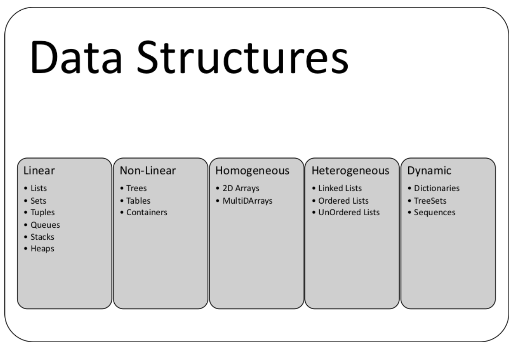

# A Simple Introduction About Tis Chapter

In this chapter, we will focus on the **definition of abstract datatypes**, classifying data structures into **linear**, **nonlinear**, **homogeneous**, **heterogeneous**, and **dynamic types**. 

Abstract datatypes, such as **Container**, **List**, **Set**, **Map**, **Graph**, **Stack**, and **Queue**, are presented in this chapter.

## We will foucus on...
- Classification of data structures and structural design patterns
- Representation of algorithms
- Complexity and performance analysis
- Brute force algorithms
- Divide and conquer algorithms
- Backtracking algorithms

